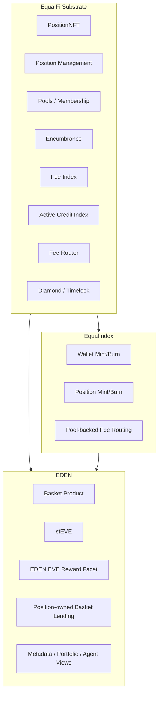

# Design Document: EDEN on EqualFi

## Overview

This design specifies how EDEN should be built on the EqualFi substrate and
EqualIndex accounting model.

The key architectural decision is to stop treating EDEN as a standalone
protocol architecture. Instead:

- EqualFi substrate is canonical
- EqualIndex accounting is canonical
- EDEN is a product layer
- wallet-mode usage remains available
- position-mode usage is the canonical yield-bearing and lending-bearing path
- only PNFT-held stEVE earns EDEN `EVE`
- EDEN rewards use a cumulative reward index, not TWAB epochs

This gives EDEN a launchable product scope while preserving the long-term
EqualFi architecture.

### Design Goals

1. Reuse EqualFi substrate primitives instead of recreating them
2. Keep EqualIndex accounting intact where possible
3. Support both EOA simplicity and PNFT-native advanced flows
4. Make EDEN rewards substrate-native and position-owned
5. Make EDEN lending position-owned from day one
6. Preserve future compatibility with later EqualFi modules

### Build Phases

- **Phase 1**: Substrate completion for position-owned principal and membership
- **Phase 2**: EqualIndex-native EDEN basket layer
- **Phase 3**: stEVE position flows and EDEN reward facet
- **Phase 4**: Position-owned EDEN lending
- **Phase 5**: Views, governance, deployment, and hardening

## Architecture

### Layered Model



### Canonical Ownership Model

There are two product modes:

1. **Wallet mode**
   - users mint, hold, transfer, and burn from EOAs
   - balances are simple ERC-20 balances
   - no EDEN `EVE` emissions accrue to wallet-held stEVE

2. **Position mode**
   - users deposit product balances into Position NFTs
   - balances become position-owned principal
   - principal is eligible for fee-index settlement, encumbrance, and EDEN `EVE`

This mirrors EqualIndex:

- wallets remain simple
- positions are economic accounts

### Why TWAB Is Removed

The old EDEN TWAB epoch design existed because rewards were tied to a
transferable wallet token and historical balance reconstruction.

In the EqualFi-native model:

- reward eligibility is limited to PNFT-held stEVE
- PNFT-held stEVE is already explicit principal
- position-owned principal changes at known transition points

So we do not need TWAB history. We can use direct principal-time reward accrual.

## Components and Interfaces

### EqualFi Substrate Components

These remain canonical and should be reused rather than replaced:

- `PositionNFT`
- `LibPositionHelpers`
- pool storage and membership
- `PositionManagementFacet`
- `LibEncumbrance`
- `LibFeeIndex`
- `LibActiveCreditIndex`
- `LibFeeRouter`
- timelock / diamond governance

### EqualIndex Components

These remain canonical for index-like principal behavior:

- wallet mint/burn
- position mint/burn
- FI settlement around principal changes
- pool-native fee routing

EDEN should reuse the same accounting conventions where possible rather than
forking them into a custom subsystem.

### EDEN Product Components

EDEN-specific components to build:

- basket storage / metadata
- basket token contracts
- stEVE token/product semantics
- EDEN reward facet for `EVE`
- EDEN lending facet using `positionKey`
- EDEN metadata / portfolio / agent views
- EDEN-specific deployment assembly

## Reward System Design

### Core Rule

Only stEVE deposited into Position NFTs earns EDEN `EVE`.

Wallet-held stEVE:

- is transferable
- can be minted and burned
- does not accrue EDEN emissions

### State

The EDEN reward facet should maintain:

```solidity
struct RewardConfig {
    address rewardToken; // EVE
    uint256 rewardRatePerSecond;
    uint256 lastRewardUpdate;
    uint256 globalRewardIndex;
    uint256 eligibleSupply;
    bool enabled;
}

mapping(bytes32 => uint256) positionRewardIndex;
mapping(bytes32 => uint256) accruedRewards;
mapping(bytes32 => uint256) eligiblePrincipal;
```

`eligiblePrincipal[positionKey]` is the amount of stEVE principal inside the
position that participates in EDEN emissions.

### Global Accrual

On any reward-relevant interaction:

1. compute elapsed time since `lastRewardUpdate`
2. compute `newRewards = rewardRatePerSecond * elapsed`
3. if `eligibleSupply > 0`, increase `globalRewardIndex` by
   `newRewards / eligibleSupply`
4. update `lastRewardUpdate`

### Position Settlement

Before any change to a position’s eligible stEVE:

1. settle global reward state
2. compute `delta = globalRewardIndex - positionRewardIndex[positionKey]`
3. add `eligiblePrincipal[positionKey] * delta` to `accruedRewards[positionKey]`
4. checkpoint `positionRewardIndex[positionKey] = globalRewardIndex`

Then the principal change is applied.

### Reward-Relevant Transitions

The reward facet must hook into:

- deposit stEVE to position
- withdraw stEVE from position
- mint stEVE directly into a position
- burn stEVE from a position
- claim rewards
- Position NFT transfer if ownership semantics need explicit settlement

### Funding Semantics

Funding should be explicit and separate from fee routing.

Recommended flow:

- admin or reward-manager funds `EVE` into the reward facet
- reward accrual can continue only so long as there is sufficient funding
- claims draw from funded `EVE`

The design should not silently burn accrued rewards due to underfunding. If
necessary, the facet can track funded capacity and bound accrual or claims
explicitly.

## stEVE Position Flow

### Deposit To Position

Users can move stEVE from wallet balances into a Position NFT.

Flow:

1. validate Position NFT ownership
2. settle EDEN rewards for the position
3. transfer stEVE from wallet context into substrate principal context
4. increase position-owned eligible principal
5. increase global eligible supply

### Withdraw From Position

Users can move stEVE back out of the Position NFT.

Flow:

1. validate Position NFT ownership
2. settle EDEN rewards for the position
3. ensure no encumbrance or module restriction blocks withdrawal
4. decrease eligible principal
5. decrease global eligible supply
6. return stEVE to wallet balance

## EDEN Lending Design

### Ownership

All EDEN loans belong to `positionKey`.

The position, not the wallet address, is the borrower account.

### Collateral

Collateral locks are represented through EqualFi encumbrance primitives.

This removes the old EDEN address-scanning model and allows later EqualFi
modules to coexist on the same economic account.

### Loan State

Loan state should preserve:

- loan owner `positionKey`
- basket / pool context
- collateral amount
- principals
- maturity
- creation and closure metadata

### Preview Surfaces

The lending layer should retain deterministic preview functions:

- preview borrow
- preview repay
- preview extend

But previews should now be position-aware and account for encumbrance and
available principal through substrate helpers.

## Fee Routing Boundaries

Protocol fee routing remains a substrate concern.

EDEN emissions remain a product concern.

This boundary should be preserved:

- do not reinterpret arbitrary fee assets as EDEN `EVE`
- do not collapse fee routing and EDEN reward accounting into a single index

This keeps the design extensible and prevents EDEN product assumptions from
distorting EqualFi’s generic fee substrate.

## Governance and Deployment

### Governance

EDEN should inherit the hardened governance direction:

- 7-day timelock is canonical
- product-level admin/config surfaces remain timelock controlled
- no separate standing guardian path is introduced just for EDEN

### Deployment Assembly

EDEN should ship as a focused facet/module assembly:

- only substrate + EqualIndex + EDEN product pieces needed for launch
- no options, AMMs, auctions, or unrelated future EqualFi modules in the launch
  bundle

## Key Architectural Decisions

1. **EqualIndex stays native**: EDEN builds on it rather than recreating it.
2. **Wallet and position flows coexist**: simple users are not forced into PNFTs.
3. **PNFT-held stEVE is the only EDEN reward base**: this matches the EqualFi
   economic-account model.
4. **EDEN rewards use a cumulative index**: this preserves daily pro-rata reward
   semantics without TWAB complexity.
5. **EDEN lending is position-owned from the start**: avoiding address-owned
   loan logic now prevents a rewrite later.
6. **Fee routing and emissions stay separate**: preserving a clean substrate /
   product boundary.
7. **Launch bundle stays minimal**: EDEN launches without dragging in unfinished
   future EqualFi products.

## Correctness Properties

- **CP-1**: wallet-held stEVE does not accrue EDEN `EVE`
- **CP-2**: only PNFT-held stEVE increases `eligibleSupply`
- **CP-3**: reward accrual is proportional to eligible principal * elapsed time
- **CP-4**: settling before principal changes preserves reward correctness
- **CP-5**: Position NFT transfer preserves ownership of accrued rewards through
  the position
- **CP-6**: EDEN loans belong to `positionKey`, not wallet addresses
- **CP-7**: encumbered principal cannot be withdrawn incorrectly
- **CP-8**: fee routing behavior remains independent from EDEN reward emission
- **CP-9**: deployment assembly excludes unrelated future EqualFi modules

## Risks and Mitigations

### Risk 1: Mixed wallet and position semantics become confusing

Mitigation:

- keep the rule simple
- wallet mode is simple ownership
- position mode is economic-account ownership
- only position mode earns EDEN `EVE`

### Risk 2: Underfunded rewards create accounting mismatches

Mitigation:

- make funding state explicit
- do not silently burn accrued rewards
- keep claims and accrual bounded by explicit funded state if needed

### Risk 3: Position transfers hide important liability/reward state

Mitigation:

- make views position-centric
- expose reward, encumbrance, and loan state cleanly
- decide early whether transfers are unrestricted or later guarded when debt is
  active
