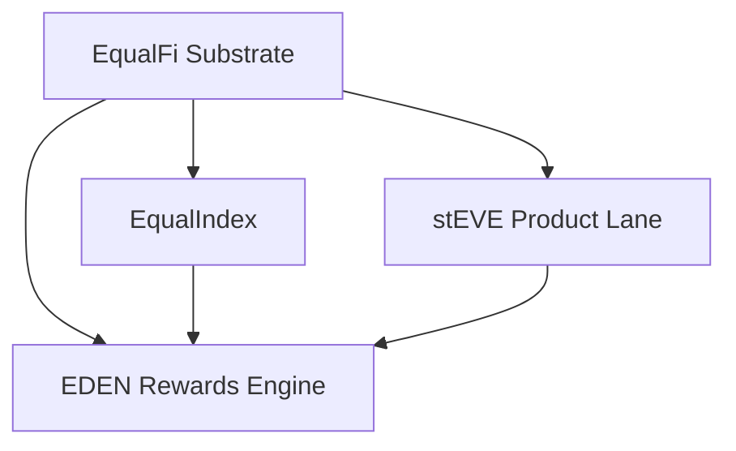

# Design Document

## Overview

This design turns **EDEN** into a shared rewards engine for EqualFi.

The architectural split is:

- **EqualFi** owns substrate primitives and canonical position accounting
- **EqualIndex** owns generic baskets / indexes
- **stEVE** owns the product-specific lane that used to be EDEN-shaped
- **EDEN** owns reward programs and reward liability accounting

This is a greenfield design. There is no backwards-compatibility requirement and
no requirement to preserve the old EDEN reward facet ABI or storage model.

The design goal is to make reward programs:

1. explicit
2. target-scoped
3. liability-safe
4. composable across consumer lanes
5. clear in naming and code shape

## Design Goals

1. Reserve EDEN naming for the rewards engine.
2. Keep `stEVE` product logic product-specific.
3. Reuse canonical position-owned accounting already present in EqualFi and EqualIndex.
4. Eliminate the mutable global reward-token pattern that created M-01.
5. Allow projects to fund reward campaigns for a specific EqualIndex basket / index.
6. Keep reward settlement lazy and deterministic.

The accepted file-by-file rename boundary is documented in
`.kiro/specs/eden-rewards-engine/rename-map.md` and should be treated as the
implementation source of truth for naming changes.

## Non-Goals

This design does not:

- make EDEN a generic basket / index issuance layer
- preserve the old single-config reward facet shape
- support wallet-held reward eligibility in v1
- require historical balance reconstruction or TWAB epochs
- require a migration layer from the old EDEN reward storage

## Layering



### Boundary Rules

1. EqualFi substrate remains the source of truth for positions, `positionKey`, pools, principal, FI / ACI, and encumbrance.
2. EqualIndex remains the generic structured-exposure layer.
3. `stEVE` remains a product lane, not the owner of the generic rewards engine.
4. EDEN owns reward programs, reward funding, reward accrual, and reward claims.

## Program Model

The core abstraction is a **reward program**.

Each program represents one campaign with:

- one target lane
- one target id
- one reward token
- one emission schedule
- one reserve
- one liability ledger

Examples:

1. A governance-funded `stEVE` rewards program paying `EVE` to PNFT-held `stEVE`.
2. A project-funded EqualIndex rewards program paying token `XYZ` to PNFT-held principal of `indexId = 7`.
3. Multiple concurrent programs over the same EqualIndex target, each with different reward tokens or rates.

The old global shape:

- one mutable reward token
- one global reserve
- one global reward index

is intentionally replaced with **program-scoped** accounting.

## Target Model

Programs should identify their target through a typed target key.

Representative shape:

```solidity
enum RewardTargetType {
    STEVE_POSITION,
    EQUAL_INDEX_POSITION
}

struct RewardTarget {
    RewardTargetType targetType;
    uint256 targetId; // 0 for stEVE singleton, indexId for EqualIndex
}
```

This keeps the engine generic enough for the intended two lanes without turning
it into an unbounded registry of unrelated staking systems.

## Program State

Representative greenfield shape:

```solidity
struct RewardProgramConfig {
    RewardTarget target;
    address rewardToken;
    address manager;
    uint256 rewardRatePerSecond;
    uint256 startTime;
    uint256 endTime;
    bool enabled;
    bool closed;
}

struct RewardProgramState {
    uint256 fundedReserve;
    uint256 lastRewardUpdate;
    uint256 globalRewardIndex;
    uint256 eligibleSupply;
}

struct RewardProgram {
    RewardProgramConfig config;
    RewardProgramState state;
}

struct EdenRewardsStorage {
    uint256 nextProgramId;
    mapping(uint256 => RewardProgram) programs;
    mapping(uint256 => mapping(bytes32 => uint256)) positionRewardIndex;
    mapping(uint256 => mapping(bytes32 => uint256)) accruedRewards;
}
```

This is intentionally program-scoped. There is no mutable global reward token.

## Why This Closes M-01

M-01 exists because the current design:

1. accrues liabilities under a global index
2. stores liabilities per position
3. pays claims in the currently configured reward token

That lets the token identity drift away from the liability origin.

In the new design:

1. liabilities are created inside a specific `programId`
2. the program’s `rewardToken` is immutable once accrual can begin
3. claims are always paid from that program’s token

The claim path therefore never needs to ask, “what is the current reward token
for this protocol?” It only asks, “what token belongs to this program?”

## Accrual Model

Each program uses a cumulative reward index.

### Global Accrual

For a given `programId`:

1. derive the effective accrual window from `lastRewardUpdate`, `startTime`, `endTime`, and `block.timestamp`
2. compute elapsed time
3. compute `maxRewards = elapsed * rewardRatePerSecond`
4. cap the allocation by `fundedReserve`
5. if `eligibleSupply > 0`, increase `globalRewardIndex` by `allocated / eligibleSupply`
6. decrease `fundedReserve` by `allocated`
7. update `lastRewardUpdate`

### Position Settlement

For a given `programId` and `positionKey`:

1. accrue the global program state
2. read the position’s current eligible balance for the program target
3. compute the delta between `globalRewardIndex` and `positionRewardIndex[programId][positionKey]`
4. add `eligibleBalance * delta` to `accruedRewards[programId][positionKey]`
5. checkpoint `positionRewardIndex[programId][positionKey]`

This preserves the standard lazy-accumulation model but binds it to one program.

## Fee-On-Transfer Reward Tokens

EDEN supports fee-on-transfer reward tokens using **net receipt semantics**.

The design rules are:

1. Program liabilities are denominated in the net amount users should receive.
2. Program funding records the gross amount of reward tokens actually received by the engine.
3. If a program configures `outboundTransferBps`, accrual converts gross reserve into net liabilities conservatively and claims gross-up transfers so the claimer can receive the intended net amount.
4. If a token behaves more aggressively than configured, the claim path clears only the actual net received and preserves the residual liability for later funding or later claims.
5. The engine must keep zero-before-transfer safety while restoring any residual liability after transfer measurement.

This means EDEN does not silently haircut a user’s claim just because the reward token taxes outbound transfers.

## Eligibility Model

### v1 Rule

Eligibility is **PNFT-owned settled balance only**.

That means:

- wallet-held `stEVE` does not accrue rewards
- wallet-held EqualIndex tokens do not accrue rewards
- only position-owned balances participate

### stEVE Lane

For `STEVE_POSITION`, the eligible base is the position’s settled reward-eligible
`stEVE` principal.

The `stEVE` lane may still maintain lane-specific accounting if needed, but EDEN
should consume it as a program target rather than hardcoding product logic into
the engine.

### EqualIndex Lane

For `EQUAL_INDEX_POSITION`, the eligible base is the position’s settled
EqualIndex principal for the specified `indexId`.

The engine should not duplicate an EqualIndex balance ledger if the canonical
balance already exists in EqualIndex pool principal.

### Settled Balance, Not Raw Historical Balance

The engine should use the balance that remains after any required canonical
settlement already imposed by the owning lane.

For EqualIndex this matters because principal can change through:

- position mint / burn
- protocol settlement affecting position principal
- lending recovery / liquidation paths

The reward engine should follow the canonical economic balance, not an unrelated
shadow number.

## Hook Model

The rewards engine should not poll balances. Consumer lanes must notify it around
balance-changing transitions.

### Required Hook Shape

At a minimum the engine needs:

1. a way to settle one program for one position
2. a way to settle all programs attached to a target for one position
3. a way to adjust program `eligibleSupply` when a target balance changes

Representative internal flow:

```solidity
function settleTargetPositionPrograms(RewardTarget memory target, bytes32 positionKey) internal;
function beforeTargetBalanceChange(RewardTarget memory target, bytes32 positionKey) internal;
function afterTargetBalanceChange(RewardTarget memory target, bytes32 positionKey) internal;
```

The exact ABI can differ, but the semantics should be:

- settle before balance changes
- update supply after the owning lane finishes the balance mutation

## Reward-Relevant Transitions

### stEVE

The `stEVE` lane must notify EDEN on:

- deposit `stEVE` to a position
- withdraw `stEVE` from a position
- mint `stEVE` directly into a position, if supported
- burn `stEVE` from a position, if supported
- any recovery or admin path that changes reward-eligible PNFT-owned `stEVE`

### EqualIndex

EqualIndex must notify EDEN on:

- `mintFromPosition`
- `burnFromPosition`
- any liquidation / recovery / recovery-burn path that changes position-owned principal for an `indexId`
- any future path that directly changes eligible PNFT-held index principal

## Claims

Claims should be program-scoped.

Representative shape:

```solidity
function claimProgramRewards(uint256 programId, uint256 positionId, address to)
    external
    returns (uint256 claimed);
```

Optional convenience methods can aggregate across programs, but the underlying
liability model should remain per program.

### Claim Semantics

1. validate position ownership
2. settle the program for the position
3. read `accruedRewards[programId][positionKey]`
4. zero the accrued amount
5. transfer the program’s immutable reward token

Aggregated multi-program claims are acceptable later, but should be built as a
thin loop over program-scoped claims rather than as a new pooled liability model.

## Funding

Funding is explicit and separate from fee routing.

Representative flow:

1. create program with immutable config
2. fund program with its reward token
3. start or enable accrual
4. accrue only while reserve remains

This keeps the state machine simple:

- no “reward token swap”
- no reinterpreting fee assets as reward liabilities
- no obligation drift between reserve and claim token identity

## Lifecycle

Recommended lifecycle:

1. **Created**
   - config exists
   - token fixed
   - no accrual until enabled/start reached
2. **Active**
   - accrues while enabled, in window, and funded
3. **Paused**
   - accrual halted
   - existing liabilities remain claimable
4. **Ended**
   - time window complete or manager disables future accrual
   - liabilities remain claimable
5. **Closed**
   - only after liabilities are settled or explicitly preserved through a safe closure path

The important property is that a lifecycle transition never mutates the token
identity of existing liabilities.

## Views

The read surface should expose:

- list / lookup of reward programs by target
- per-program config and reserve state
- preview global reward index for a program
- preview claimable rewards for one position in one program
- aggregated claimable amounts for one position across program ids

Views should make the following obvious:

- which target a program belongs to
- which reward token it pays
- whether it is active
- how much reserve remains

## Security Constraints

### 1. Token Identity Is Immutable Per Program

This is the primary fix for M-01.

### 2. Reserve Bounds Accrual

Accrual must never exceed funded reserve.

### 3. Liability Settlement Happens Before Balance Mutation

If a position’s eligible base changes before settlement, the program can
underpay or overpay that position.

### 4. Consumer Lanes Remain Canonical for Eligibility

The reward engine should consume canonical balances from `stEVE` and EqualIndex
rather than inventing a new parallel ownership model.

### 5. Program Isolation

One program’s rate, reserve, or claims must not affect another program’s
liabilities even if they share a target.

## Naming Migration

This spec intentionally implies a codebase rename boundary:

- product-specific EDEN code should migrate toward `stEVE` naming
- shared reward-program code should use `EDEN` naming

Representative target direction:

- `EdenRewardFacet` or `EdenRewardsFacet` becomes the shared rewards engine
- product-specific action/storage/view modules move toward `StEVE...` naming

The point is not cosmetic cleanup. The point is that code names should make the
architecture obvious.

## Validation Strategy

The design is correct only when tests prove:

1. liabilities remain payable in their originating token
2. reserve bounds accrual
3. only eligible PNFT-held balances earn
4. balance-changing transitions settle before eligibility changes
5. multiple programs over the same target remain isolated
6. `stEVE` and EqualIndex can both consume the engine without ownership drift
