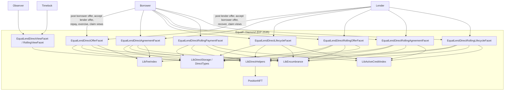

# Design Document: EqualLend Direct Clean Break

## Overview

EqualLend Direct is the EqualFi bilateral credit layer for Position NFT-owned
lending agreements.

It is not merely a loan table. EqualLend Direct is a bilateral credit product
with embedded option-like rights:

- borrower-side early repay rights
- borrower-side exercise / surrender rights
- lender-side call or acceleration rights
- collateral seizure and recovery rights
- rolling cure and cadence-dependent settlement rights

That means the rebuild should be designed as a rights-and-settlement engine
with loan-shaped accounting, not as a plain debt ledger.

This clean-break rebuild keeps three required product families:

- fixed direct loans
- rolling direct loans
- ratio-tranche direct loans

The design principle is simple:

1. fixed direct defines the canonical accounting model
2. rolling direct reuses that same accounting model with additional cadence
   state
3. ratio tranches reuse that same accounting model with partial-fill state

The rebuild is explicitly not a line-by-line migration of the sibling repo. It
is a product-preserving, accounting-simplifying reconstruction for EqualFi.

## Design Goals

- Preserve the required direct-lending product surface, including rolling and
  ratio tranches
- Keep Position NFT ownership and transfer semantics canonical
- Use one lender-capital departure and return model across all direct products
- Use one borrower-debt model across all direct products
- Keep same-asset active-credit treatment explicit and shared
- Keep offer and agreement indexes coherent for fixed, rolling, and ratio state
- Preserve the embedded option-like rights model inside direct agreements
- Make real-flow testing the authority for all value-moving behavior

## Non-Goals

This clean-break does not attempt to:

- preserve exact storage layouts from the sibling repository
- preserve every helper or event shape if a cleaner surface is needed
- add new product families beyond fixed, rolling, and ratio-tranche direct
  credit
- add offchain order books, reputation systems, or protocol backstops
- merge direct lending into EqualScale Alpha or other credit products

## Architecture

### System Context



### Facet Responsibilities

| Facet | Responsibility |
|-------|----------------|
| `EqualLendDirectOfferFacet` | fixed offers, tranche offers, offer cancellation, transfer-safe cleanup |
| `EqualLendDirectAgreementFacet` | fixed agreement origination for plain and ratio-tranche fills |
| `EqualLendDirectLifecycleFacet` | fixed repayment, borrower exercise, lender call, recovery |
| `EqualLendDirectRollingOfferFacet` | rolling offer posting and cancellation |
| `EqualLendDirectRollingAgreementFacet` | rolling agreement origination |
| `EqualLendDirectRollingPaymentFacet` | rolling scheduled payments and amortization |
| `EqualLendDirectRollingLifecycleFacet` | rolling full closeout, exercise, and recovery |
| `EqualLendDirectViewFacet` | fixed, tranche, and aggregate direct views plus config writes |
| `EqualLendDirectRollingViewFacet` | rolling payment previews, status, and exposure views |

## Core Accounting Model

### 1. Canonical Encumbrance Meanings

The clean-break rebuild keeps direct state anchored to `LibEncumbrance`.

- `lockedCapital`: borrower collateral or maker-owned capital locked in place
  for an active or pre-active obligation
- `offerEscrowedCapital`: lender capital reserved for posted offers but not yet
  converted into live exposure
- `encumberedCapital`: live capital committed to active exposure after an offer
  has been filled

These meanings must be identical for fixed, rolling, and ratio-tranche flows.

The rebuild must reuse the existing EqualFi encumbrance primitive in this
workspace as the only canonical lock/exposure surface for direct lending.

It must not introduce:

- parallel direct-only encumbrance storage
- rolling-only lock helpers with different semantics
- ratio-tranche-only reserve ledgers
- shadow accounting that mirrors `lockedCapital`, `offerEscrowedCapital`, or
  `encumberedCapital`

### 2. Canonical Debt Ledgers

Two ledgers govern borrower debt:

```solidity
mapping(bytes32 => mapping(uint256 => uint256)) directBorrowedPrincipal;
mapping(bytes32 => mapping(address => uint256)) directSameAssetDebt;
```

- `directBorrowedPrincipal[borrowerKey][lenderPoolId]`
  records active direct principal by funding pool
- `directSameAssetDebt[borrowerKey][poolAsset]`
  mirrors same-asset debt exposure when borrow asset equals collateral asset

Same-asset direct agreements also update the collateral pool’s
`userActiveCreditStateDebt` and `activeCreditPrincipalTotal`.

Cross-asset agreements do not touch same-asset debt state.

### 3. Origination Invariant

All agreement-originating paths must perform the same state transition.

For any accepted direct agreement:

1. settle lender and borrower pool indexes first
2. validate lender membership, borrower membership, lender solvency, borrower
   solvency, and live tracked liquidity
3. move lender-side state:
   - mutate `LibEncumbrance` to move `offerEscrowedCapital ->
     encumberedCapital` when offer-based
   - `lenderPool.userPrincipal -= fundedAmount`
   - `lenderPool.totalDeposits -= fundedAmount`
   - `lenderPool.trackedBalance -= fundedAmount`
4. move borrower-side state:
   - mutate `LibEncumbrance` to increase `lockedCapital` when collateral is
     newly locked
   - `directBorrowedPrincipal += fundedAmount`
5. if same-asset:
   - `activeCreditPrincipalTotal += fundedAmount`
   - update `userActiveCreditStateDebt`
   - `directSameAssetDebt += fundedAmount`
6. store agreement record and index it symmetrically
7. transfer or credit net proceeds according to the product rules

Rolling origination and ratio-tranche origination are not allowed to invent
alternate debt behavior.

They are also not allowed to invent alternate encumbrance behavior.

### 4. Repayment and Recovery Invariant

Any path that repays or recovers value for the lender side must restore
pool-position accounting first.

That means:

- borrower-paid borrow-asset funds return to lender-side pool accounting rather
  than bypassing it permanently
- principal reduction decreases `encumberedCapital`,
  `directBorrowedPrincipal`, and same-asset debt only by the principal
  component
- terminal closeout removes all remaining lender and borrower direct state for
  that agreement

Wallet extraction by the current Position NFT owner remains a separate
position-withdrawal concern, not a shortcut around pool accounting.

This is especially important because direct lifecycle actions are effectively
settlement actions on contingent rights:

- repay settles the borrower’s right to retire the agreement with cash
- exercise settles the borrower’s right to surrender collateral under the
  agreed rules
- call settles the lender’s right to accelerate timing
- recover settles the lender or permissionless actor’s right to seize and
  distribute collateral after the permitted window

Treating these as explicit settlement paths helps keep direct aligned with the
rest of EqualFi’s capital-encumbering product semantics.

## Product Variants

### Fixed Direct

Fixed direct remains the baseline bilateral agreement.

Commercial fields:

- principal
- APR
- duration
- collateral lock amount
- allow early repay
- allow early exercise
- allow lender call

Economic treatment:

- interest and platform fees are realized at origination according to direct
  config
- lender-side and protocol-side allocations route through existing EqualFi
  accounting
- repayment closes principal in one fixed-term settlement path
- early repay, early exercise, and lender call are explicit rights selections
  on the agreement, not incidental helper flags

### Rolling Direct

Rolling direct adds cadence state but not a second accounting model.

Additional fields:

- payment interval
- rolling APY
- grace period
- payment-count cap
- upfront premium
- allow amortization

State additions:

```solidity
struct DirectRollingAgreement {
    uint256 principal;
    uint256 outstandingPrincipal;
    uint256 arrears;
    uint64 nextDue;
    uint64 lastAccrualTimestamp;
    uint16 paymentCount;
    ...
}
```

Rolling agreements differ from fixed only in lifecycle math:

- scheduled payments can cover arrears, current interest, and optionally
  principal
- repayment eligibility and recovery timing are cadence-based
- full closeout and recovery still clear the same underlying direct ledgers
- the rolling product still represents contingent bilateral exercise and
  recovery rights, just with recurring-payment state layered on top

### Ratio Tranches

Ratio tranches are partial-fill wrappers around fixed-term direct origination.

Two offer families exist:

- lender-posted ratio tranches: reusable principal cap
- borrower-posted ratio tranches: reusable collateral cap

Core rule:

- every fill resolves into one normal direct agreement using the shared
  origination path

This keeps partial-fill logic separate from debt accounting.

It also keeps tranche logic separate from rights logic: the partial-fill order
book determines how much gets originated, while the resulting agreement still
inherits the same borrower and lender rights model as any other direct
agreement.

## Storage Model

### Storage Namespace

The rebuild may keep the existing direct storage namespace if it stays isolated
and clean:

```solidity
bytes32 internal constant DIRECT_STORAGE_POSITION =
    keccak256("equallend.direct.storage");
```

If a new namespace is cleaner, the rebuild should prefer clarity over port
fidelity.

### Core Types

The clean-break storage should keep three layers:

1. config
2. offers and agreements
3. indexes and reverse lookups

Representative outline:

```solidity
enum DirectProductKind {
    Fixed,
    Rolling
}

enum OfferKind {
    None,
    LenderFixed,
    BorrowerFixed,
    LenderRatioTranche,
    BorrowerRatioTranche,
    LenderRolling,
    BorrowerRolling
}

struct DirectConfig {
    uint16 platformFeeBps;
    uint16 interestLenderBps;
    uint16 platformFeeLenderBps;
    uint16 defaultLenderBps;
    uint40 minInterestDuration;
}

struct DirectRollingConfig {
    uint32 minPaymentIntervalSeconds;
    uint16 maxPaymentCount;
    uint16 maxUpfrontPremiumBps;
    uint16 minRollingApyBps;
    uint16 maxRollingApyBps;
    uint16 defaultPenaltyBps;
    uint16 minPaymentBps;
}
```

### Agreement Indexing

The rebuild must stop index drift by making indexing explicit.

Recommended model:

- one generic borrower-agreement index
- one generic lender-agreement index
- one rolling-borrower index
- one rolling-lender index
- one fixed-offer index per offer family
- one rolling-offer index per offer family
- one explicit `OfferKind` / `AgreementKind` discriminator

Every add must have one symmetric remove on every terminal path.

## Transfer Semantics

Position NFT ownership remains canonical.

Open offers:

- transfer must either be blocked or deterministically cancel offers
- the rule must be consistent across fixed, rolling, and ratio-tranche offers

Active agreements:

- rights and obligations follow the Position NFT
- current owner or approved operator becomes the actor for borrower-side and
  lender-side controls where allowed

## View Surface

The view layer should be structured around product truths rather than ad hoc
storage peeks.

Required reads:

- get fixed offer
- get borrower fixed offer
- get rolling offer
- get borrower rolling offer
- get lender ratio-tranche offer
- get borrower ratio-tranche offer
- get fixed agreement
- get rolling agreement
- get position borrower agreements
- get position lender agreements
- get position offers by family
- get rolling status and payment preview
- get direct position state and pool active direct lent

## Testing Strategy

### Real-Flow Authority

Every value-moving behavior needs at least one real-flow test:

- lender-posted fixed offer to repayment
- borrower-posted fixed offer to recovery
- lender-posted rolling offer through recurring payments and full closeout
- borrower-posted rolling offer through recovery
- lender-posted ratio-tranche multi-fill lifecycle
- borrower-posted ratio-tranche multi-fill lifecycle

### Shared-Invariant Focus

Fuzz and invariant suites should prove:

- lender principal departure and return symmetry
- borrower debt ledger conservation
- same-asset debt creation and cleanup symmetry across product variants
- offer/agreement index coherence across all terminal states
- Position NFT transfer semantics preserve rights correctly

### Migration Discipline

The sibling repository is useful as a behavior inventory, not as a source of
truth for exact implementation. The greenfield EqualFi rebuild should port:

- required product semantics
- required test scenarios

It should not port:

- inconsistent accounting shortcuts
- duplicated ledgers
- variant-specific debt logic that fights the shared model
