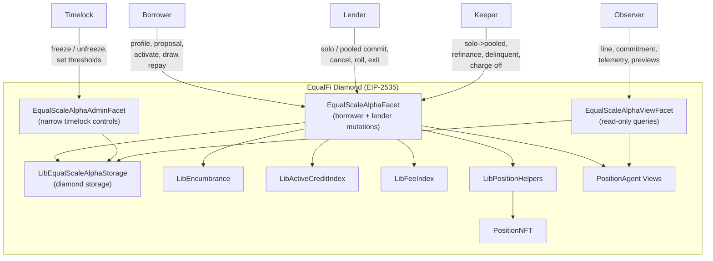
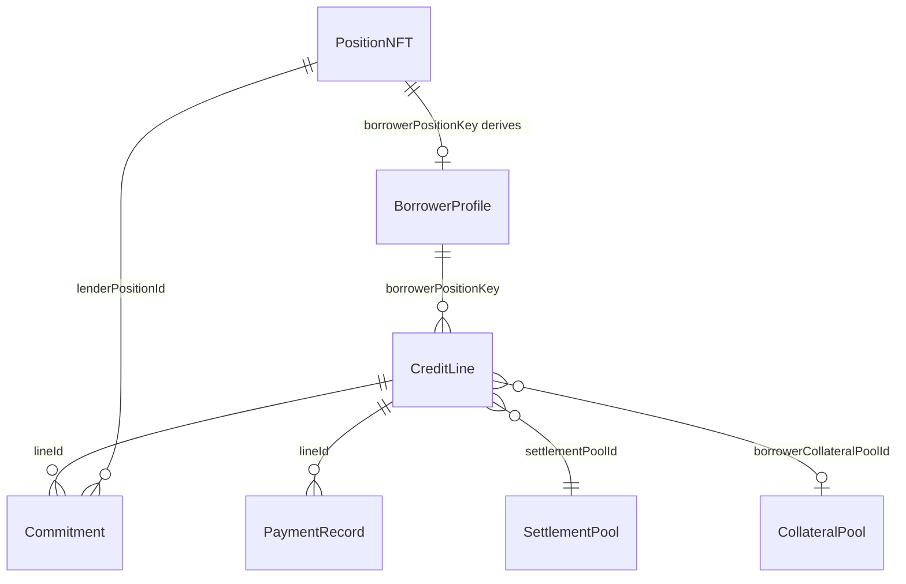
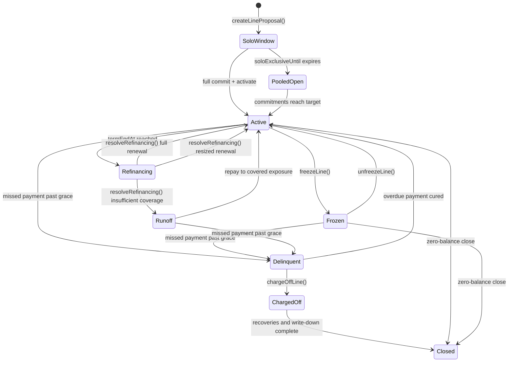

# Design Document: EqualScale Alpha

> Supersession note
>
> Reservation semantics in this legacy Alpha design are superseded by
> `/home/hooftly/.openclaw/workspace/Projects/EdenFi/.kiro/specs/native-encumbrance-migration/`.
> EqualScale Alpha remains a first-party EqualFi venue and therefore uses
> canonical `encumberedCapital` for lender commitments and canonical
> `lockedCapital` for borrower-posted collateral. Module namespaces are
> reserved for future third-party extensions rather than native Alpha behavior.

## Overview

EqualScale Alpha is a borrower-position / lender-position credit agreement layer
on top of EqualFi.

It is not a pooled treasury lender and not a generalized underwriting engine.
It is a line-proposal system where:

- the borrower authors commercial terms from a borrower Position NFT
- lenders opt in from lender Position NFTs
- lender capital is reserved through canonical `encumberedCapital` at commitment time
- borrower collateral is optional and proposal-defined
- draw pacing and payment obligations are enforced mechanically
- losses can be borne by lenders in Alpha

The design intentionally reuses:

- Position NFT ownership and transfer semantics
- `positionKey`-based accounting
- canonical encumbrance buckets
- fee / active-credit settlement discipline
- the ERC-6551 / ERC-6900 / ERC-8004 position-agent wallet stack

## Non-Goals

EqualScale Alpha does not include:

- an insurance module or first-loss reserve
- automated offchain revenue inference
- reputation scoring or trust weighting
- pooled protocol guarantees against borrower default
- generalized free-form agent finance outside the line-proposal model

## Architecture

### System Context



### Facet Responsibility Split

| Facet | Caller | Functions |
|-------|--------|-----------|
| `EqualScaleAlphaFacet` | Borrower, Lender, Anyone | `registerBorrowerProfile`, `updateBorrowerProfile`, `createLineProposal`, `updateLineProposal`, `cancelLineProposal`, `commitSolo`, `transitionToPooledOpen`, `commitPooled`, `cancelCommitment`, `activateLine`, `draw`, `repay`, `enterRefinancing`, `rollCommitment`, `exitCommitment`, `resolveRefinancing`, `markDelinquent`, `chargeOffLine`, `closeLine` |
| `EqualScaleAlphaAdminFacet` | Timelock | `freezeLine`, `unfreezeLine`, `setChargeOffThreshold`, optional `setProposalCreationPaused` |
| `EqualScaleAlphaViewFacet` | Anyone | `getBorrowerProfile`, `getCreditLine`, `getBorrowerLineIds`, `getLineCommitments`, `getLenderPositionCommitments`, `previewDraw`, `previewRepay`, `currentMinimumDue`, `getTreasuryTelemetry`, `getRefinanceStatus`, `getLineLossSummary` |

## Core Product Model

### 1. Identity

Borrower identity is anchored to the existing position-agent wallet stack.
EqualScale Alpha does not introduce a second canonical identity registry. A
borrower position must already have a completed registration through the
position-agent system before it can register a borrower profile.

### 2. Proposal-Driven Credit

The borrower creates a line proposal containing the exact terms lenders may
accept:

- settlement pool
- requested target limit
- minimum viable line
- APR
- minimum payment per period
- max draw per period
- payment cadence and grace period
- facility term and refinance window
- optional borrower collateral terms

The protocol does not decide whether those terms are attractive. Lenders do.

### 3. Position-Owned Lender Exposure

Lenders commit from lender Position NFTs in the settlement pool. A commitment is
not a transfer into a pooled escrow; it is a settlement-pool principal
reservation through canonical `encumberedCapital`.

This keeps the design consistent with the rest of EqualFi:

- lender exposure belongs to a lender position
- lender rights move with lender Position NFT ownership
- the underlying pool accounting remains on the EqualFi substrate

### 4. Optional Borrower Collateral

Collateral is optional, not mandatory:

```solidity
enum CollateralMode {
    None,
    BorrowerPosted
}
```

- `None`: unsecured line; lender recovery is limited to repayments and protocol
  recoveries explicitly defined in Alpha
- `BorrowerPosted`: borrower position principal in another pool is locked on
  activation through canonical `lockedCapital` and may be recovered in the
  unhappy path

### 5. Alpha Loss Model

Alpha allows lender losses.

If a borrower draws, fails to repay, and the line ends with unrecovered
principal, the protocol does not socialize or insure that loss. Instead:

1. optional borrower collateral is recovered first
2. all recovered value is applied pro rata to lenders
3. remaining unpaid principal is written down pro rata against lender
   commitments

An insurance module may be added later, but it is out of scope for Alpha.

## Storage Model

### Storage Namespace

```solidity
bytes32 internal constant STORAGE_POSITION = keccak256("equalscale.alpha.storage");
```

### Enums

```solidity
enum CollateralMode {
    None,
    BorrowerPosted
}

enum CreditLineStatus {
    SoloWindow,
    PooledOpen,
    Active,
    Refinancing,
    Runoff,
    Delinquent,
    Frozen,
    ChargedOff,
    Closed
}

enum CommitmentStatus {
    Active,
    Canceled,
    Rolled,
    Exited,
    WrittenDown,
    Closed
}
```

### BorrowerProfile

`BorrowerProfile` must not duplicate the canonical wallet-side identity state.
It stores only borrower-specific metadata:

```solidity
struct BorrowerProfile {
    bytes32 borrowerPositionKey;
    address treasuryWallet;
    address bankrToken;
    bytes32 metadataHash;
    bool active;
}
```

Live identity data is resolved through the existing position-agent views.

### CreditLine

```solidity
struct CreditLine {
    bytes32 borrowerPositionKey;
    uint256 borrowerPositionId;

    // Proposal terms
    uint256 settlementPoolId;
    uint256 requestedTargetLimit;
    uint256 minimumViableLine;
    uint16 aprBps;
    uint256 minimumPaymentPerPeriod;
    uint256 maxDrawPerPeriod;
    uint32 paymentIntervalSecs;
    uint32 gracePeriodSecs;
    uint40 facilityTermSecs;
    uint40 refinanceWindowSecs;
    CollateralMode collateralMode;
    uint256 borrowerCollateralPoolId;
    uint256 borrowerCollateralAmount;

    // Live term state
    uint256 activeLimit;
    uint256 currentCommittedAmount;
    uint256 lockedCollateralAmount;
    uint256 outstandingPrincipal;
    uint256 accruedInterest;
    uint256 totalPrincipalRepaid;
    uint256 totalInterestRepaid;
    uint256 currentPeriodDrawn;
    uint40 currentPeriodStartedAt;
    uint40 interestAccruedAt;
    uint40 nextDueAt;
    uint40 termStartedAt;
    uint40 termEndAt;
    uint40 refinanceEndAt;
    uint40 soloExclusiveUntil;
    uint40 delinquentSince;
    uint8 missedPayments;
    CreditLineStatus status;
}
```

### Commitment

```solidity
struct Commitment {
    uint256 lenderPositionId;
    bytes32 lenderPositionKey;
    uint256 settlementPoolId;
    uint256 committedAmount;
    uint256 principalExposed;
    uint256 principalRepaid;
    uint256 interestReceived;
    uint256 lossWrittenDown;
    CommitmentStatus status;
}
```

### View Structs

```solidity
struct PaymentRecord {
    uint40 paidAt;
    uint256 amount;
    uint256 principalComponent;
    uint256 interestComponent;
}

struct TreasuryTelemetryView {
    uint256 treasuryBalance;
    uint256 outstandingPrincipal;
    uint256 accruedInterest;
    uint256 nextDueAmount;
    bool paymentCurrent;
    bool drawsFrozen;
    uint256 currentPeriodDrawn;
    uint256 maxDrawPerPeriod;
    CreditLineStatus status;
}

struct RefinanceStatusView {
    uint40 termEndAt;
    uint40 refinanceEndAt;
    uint256 currentCommittedAmount;
    uint256 activeLimit;
    uint256 outstandingPrincipal;
    bool refinanceWindowActive;
}
```

## Native Encumbrance Design

EqualScale Alpha should use canonical native buckets rather than per-line
module namespaces:

- lender settlement commitments reserve `encumberedCapital`
- borrower-posted collateral reserves `lockedCapital`
- per-line attribution stays in Alpha-native `CreditLine` and `Commitment`
  storage

## Entity Relationships



## Lifecycle State Machine



## Key Algorithms

### 1. Solo Window -> Pooled Open

```text
transitionToPooledOpen(lineId):
    require line.status == SoloWindow
    require block.timestamp > line.soloExclusiveUntil
    line.status = PooledOpen
    emit CreditLineOpenedToPool(lineId)
```

This transition is permissionless once the solo window expires.

### 2. Commitment-Time Lender Encumbrance

```text
commitPooled(lineId, lenderPositionId, amount):
    require current owner of lenderPositionId
    require lender position belongs to settlement pool
    settle lender position indexes
    require available lender principal >= amount
    increase canonical encumberedCapital for the lender position
    record / update commitment keyed by lender position
    increase currentCommittedAmount
```

This is when lender capital becomes bound to the line.

### 3. Activation Flow

```text
activateLine(lineId):
    require line.status in {SoloWindow, PooledOpen}
    require line.currentCommittedAmount >= accepted activation threshold
    if collateralMode == BorrowerPosted:
        settle borrower collateral position
        increase canonical lockedCapital for the borrower position
    line.status = Active
    line.activeLimit = accepted amount
    line.nextDueAt = block.timestamp + line.paymentIntervalSecs
    line.termStartedAt = block.timestamp
    line.termEndAt = block.timestamp + line.facilityTermSecs
    line.refinanceEndAt = line.termEndAt + line.refinanceWindowSecs
    line.currentPeriodStartedAt = block.timestamp
    emit CreditLineActivated(...)
```

### 4. Draw Mechanics

```text
draw(lineId, amount):
    require borrower Position NFT ownership
    require line.status == Active
    if block.timestamp >= currentPeriodStartedAt + paymentIntervalSecs:
        currentPeriodStartedAt = block.timestamp
        currentPeriodDrawn = 0
    require currentPeriodDrawn + amount <= maxDrawPerPeriod
    require outstandingPrincipal + amount <= activeLimit
    settle borrower position indexes
    line.outstandingPrincipal += amount
    line.currentPeriodDrawn += amount
    allocate principalExposed pro rata across commitments
    emit CreditDrawn(...)
```

### 5. Repayment Routing

```text
repay(lineId, amount):
    accrue interest first
    effectiveAmount = min(amount, outstandingPrincipal + accruedInterest)
    interestComponent = min(effectiveAmount, accruedInterest)
    principalComponent = effectiveAmount - interestComponent
    settle borrower position indexes
    line.accruedInterest -= interestComponent
    line.outstandingPrincipal -= principalComponent
    line.totalInterestRepaid += interestComponent
    line.totalPrincipalRepaid += principalComponent
    distribute interestComponent and principalComponent pro rata across commitments
    if minimum due satisfied within grace window:
        line.nextDueAt += line.paymentIntervalSecs
    if delinquent and overdue amount cured:
        line.status = Active
    if runoff and outstandingPrincipal <= currentCommittedAmount:
        line.status = Active
        reset next term timestamps
    emit CreditPaymentMade(...)
```

### 6. Refinance Resolution

```text
resolveRefinancing(lineId):
    require line.status == Refinancing
    require block.timestamp >= line.refinanceEndAt
    if currentCommittedAmount >= requestedTargetLimit:
        renew at full size
    else if currentCommittedAmount >= outstandingPrincipal
        and currentCommittedAmount >= borrowerAcceptedResizedLimit:
        renew at smaller activeLimit
    else:
        line.status = Runoff
        emit CreditLineEnteredRunoff(...)
```

### 7. Treasury Coverage Computation

```text
getTreasuryTelemetry(lineId):
    treasuryBalance = IERC20(underlying).balanceOf(profile.treasuryWallet)
    nextDueAmount = currentMinimumDue(lineId)
    paymentCurrent = block.timestamp <= line.nextDueAt + line.gracePeriodSecs
    drawsFrozen = line.status != Active
```

Telemetry stays trust-minimized. No fake `trailingRevenue30d` field is claimed
unless a real onchain source is later specified.

## Repayment and Write-Down Allocation

### Repayments

Repayments are distributed pro rata to active commitments:

- interest received increases each commitment’s `interestReceived`
- principal repaid reduces each commitment’s `principalExposed`

### Recoveries

Collateral recovery, if any, is treated as settlement value and also applied pro
rata to lender commitments.

### Losses

Any remaining unpaid principal after repayment and collateral recovery is
written down pro rata:

```text
commitmentLoss = residualLoss * commitmentPrincipalExposed / totalPrincipalExposed
```

That value is stored on the commitment and exposed in views. This is how Alpha
truthfully represents lender impairment.

## Admin and Liveness Model

### Permissionless

These should be callable by anyone once conditions are met:

- transition solo -> pooled
- enter refinancing
- mark delinquent
- charge off line
- resolve refinance after the refinance window

### Admin / Timelock

These remain timelock-governed:

- freeze line
- unfreeze line
- set charge-off threshold
- optional emergency pause of new proposal creation

This split avoids the “nothing is automatic but nobody can legally poke the
state machine” problem.

## View Surface

At minimum, the view facet should expose:

- borrower profile by position
- line by line ID
- line IDs by borrower position
- commitments by line
- commitments by lender position
- preview draw
- preview repay
- current minimum due
- treasury telemetry
- line loss summary

Treasury telemetry should stay intentionally modest and trust-minimized:

- treasury wallet balance
- outstanding principal
- accrued interest
- next due amount
- payment current flag
- line status
- draw usage this period

## Correctness Properties

The following properties define the formal correctness invariants that
EqualScale Alpha must satisfy. Each property maps to one or more requirements
and will be validated through property-based testing.

### Property 1: Storage Isolation Integrity
**Requirement(s):** R15
**Description:** EqualScale Alpha storage never collides with EDEN lending or other product storage.
**Formal Property:** For all operations on EqualScale Alpha state, the storage slot `keccak256("equalscale.alpha.storage")` is distinct from EDEN lending and other product storage slots.
**Testing approach:** Unit assertion that storage position constants are distinct across storage libraries in the codebase.

### Property 2: Position Ownership Gate
**Requirement(s):** R1, R2, R3, R5
**Description:** Only the current owner of a Position NFT can mutate borrower or lender state keyed by that position.
**Formal Property:** For all position-owned mutations `f(positionId, ...)`, if `msg.sender != PositionNFT.ownerOf(positionId)`, then `f` reverts.
**Testing approach:** Fuzz with random callers and position IDs; assert revert when caller ≠ owner.

### Property 3: Borrower Profile Uniqueness
**Requirement(s):** R1
**Description:** Each borrower positionKey maps to at most one active BorrowerProfile.
**Formal Property:** For all positionKeys `pk`, if `borrowerProfiles[pk].active == true`, then calling `registerBorrowerProfile` with the same `pk` reverts.
**Testing approach:** Fuzz register sequences; assert double-registration always reverts.

### Property 4: Credit Line ID Monotonicity
**Requirement(s):** R3, R15
**Description:** Line IDs are assigned strictly monotonically.
**Formal Property:** For any two lines created in sequence, `lineId_n+1 > lineId_n`.
**Testing approach:** Fuzz multiple proposal creations; assert each returned lineId is strictly greater than the previous.

### Property 5: Solo Window Exclusivity
**Requirement(s):** R5
**Description:** During the solo window, only a full-take commitment is accepted.
**Formal Property:** For all lines in `SoloWindow`, any pooled-style partial commitment reverts. Only a full target-limit solo commit succeeds.
**Testing approach:** Fuzz commitment amounts during SoloWindow; assert partial commits revert and full commits succeed.

### Property 6: Solo Window Expiry Transition
**Requirement(s):** R5
**Description:** A line in SoloWindow transitions to PooledOpen only after `soloExclusiveUntil`.
**Formal Property:** If `block.timestamp <= soloExclusiveUntil`, then `transitionToPooledOpen` reverts. Otherwise it transitions if no solo lender already took the line.
**Testing approach:** Fuzz timestamps around the solo boundary; assert correct transition or revert.

### Property 7: Pooled Commitment Cap
**Requirement(s):** R5
**Description:** Pooled commitments never exceed the requested target limit.
**Formal Property:** For all lines, `currentCommittedAmount <= requestedTargetLimit` after any commit flow.
**Testing approach:** Fuzz commitment sequences; assert committed amount never exceeds target.

### Property 8: Activation Precondition
**Requirement(s):** R6
**Description:** A line can activate only from SoloWindow or PooledOpen and only when commitment thresholds are met.
**Formal Property:** `activateLine` succeeds only when `status ∈ {SoloWindow, PooledOpen}` and accepted commitment amount is sufficient.
**Testing approach:** Fuzz activation attempts across statuses and commitment levels.

### Property 9: Draw Capacity Invariant
**Requirement(s):** R7
**Description:** Outstanding principal never exceeds active covered capacity.
**Formal Property:** For all lines, after any draw, `outstandingPrincipal <= activeLimit`.
**Testing approach:** Fuzz draw / repay sequences; assert invariant after every operation.

### Property 10: Draw Status Gate
**Requirement(s):** R7
**Description:** Draws are only permitted when status is Active.
**Formal Property:** `draw` reverts unless `status == Active`.
**Testing approach:** Fuzz draw attempts across all statuses; assert only Active allows draws.

### Property 11: Repayment Monotonicity
**Requirement(s):** R8
**Description:** Principal repaid never decreases and never exceeds principal previously exposed.
**Formal Property:** `totalPrincipalRepaid` is monotonic and bounded by total principal exposure.
**Testing approach:** Fuzz repayment sequences; assert monotonicity and cap.

### Property 12: Payment Due Advancement
**Requirement(s):** R8
**Description:** `nextDueAt` advances by exactly one interval when a sufficient payment is made on time.
**Formal Property:** If minimum due is satisfied within grace, `nextDueAt_after == nextDueAt_before + paymentIntervalSecs`.
**Testing approach:** Fuzz payment amounts and timestamps; assert due advancement logic.

### Property 13: Delinquency Transition Correctness
**Requirement(s):** R11
**Description:** A line becomes delinquent if and only if payment is missed past the grace period.
**Formal Property:** `markDelinquent` succeeds only after due + grace and only while the current minimum due is unsatisfied.
**Testing approach:** Fuzz timestamps and payment sequences; assert delinquency triggers and cures correctly.

### Property 14: Charge-Off Threshold Enforcement
**Requirement(s):** R11, R13
**Description:** Charge-off occurs only after prolonged delinquency exceeding the configured threshold.
**Formal Property:** `chargeOffLine` succeeds only when `status == Delinquent` and `block.timestamp - delinquentSince >= chargeOffThresholdSecs`.
**Testing approach:** Fuzz delinquency durations; assert charge-off only triggers past threshold.

### Property 15: Encumbrance Conservation
**Requirement(s):** R5, R6, R15
**Description:** Settlement commitments and optional borrower collateral remain correctly reserved in the canonical native buckets for the right amount.
**Formal Property:** Lender settlement reservation equals committed uncovered exposure in `encumberedCapital`, and borrower collateral reservation is present in `lockedCapital` if and only if `CollateralMode.BorrowerPosted`.
**Testing approach:** Fuzz lifecycle sequences; assert encumbrance matches expected values at each stage.

### Property 16: Native Attribution Without Module Namespaces
**Requirement(s):** R15
**Description:** EqualScale Alpha active exposure remains explainable without per-line module IDs.
**Formal Property:** Canonical `encumberedCapital` and `lockedCapital` totals can be reconciled to active Alpha `Commitment` and `CreditLine` storage without module-ID namespace lookups.
**Testing approach:** Fuzz lifecycle sequences; assert canonical bucket totals stay aligned with product-native line and commitment attribution.

### Property 17: Settlement-Before-Mutation
**Requirement(s):** R15
**Description:** Every principal or encumbrance mutation is preceded by index settlement.
**Formal Property:** For all functions that modify principal or encumbrance, active-credit and fee indexes are settled before mutation.
**Testing approach:** Integration tests with observable checkpoint changes before mutation.

### Property 18: Refinance Window Timing
**Requirement(s):** R10
**Description:** A line enters Refinancing exactly when term end is reached.
**Formal Property:** Transition to `Refinancing` is valid only when `block.timestamp >= termEndAt` and `status == Active`.
**Testing approach:** Fuzz timestamps around term end; assert correct transition timing.

### Property 19: Refinance Resolution Trichotomy
**Requirement(s):** R10
**Description:** Refinance resolution produces exactly one of three outcomes: full renewal, resized renewal, or runoff.
**Formal Property:** After `resolveRefinancing`, exactly one branch is taken based on commitment levels versus requested limit and outstanding principal.
**Testing approach:** Fuzz commitment levels and outstanding principal; assert exactly one outcome.

### Property 20: Runoff Cure Correctness
**Requirement(s):** R10
**Description:** A borrower in Runoff can cure by repaying down to covered exposure.
**Formal Property:** If `outstandingPrincipal <= currentCommittedAmount` after repayment in Runoff, the line returns to Active under a valid next term.
**Testing approach:** Fuzz repay amounts in Runoff; assert cure triggers at the correct threshold.

### Property 21: Commitment Accounting Conservation
**Requirement(s):** R9
**Description:** `currentCommittedAmount` always equals the sum of active commitment coverage.
**Formal Property:** For all lines, `currentCommittedAmount == sum(committedAmount for active commitments)` after add, cancel, roll, exit, and write-down updates.
**Testing approach:** Fuzz commitment lifecycle sequences; assert sum invariant after every operation.

### Property 22: View Round-Trip Fidelity
**Requirement(s):** R14
**Description:** View functions faithfully represent stored state.
**Formal Property:** For all stored lines and borrower profiles, the corresponding views return field-equivalent values.
**Testing approach:** Fuzz state creation; assert view output matches storage field-by-field.

### Property 23: Closed Is Terminal
**Requirement(s):** R11, R12
**Description:** Once a line reaches Closed status, no further state transitions are possible.
**Formal Property:** For all lines where `status == Closed`, every state-mutating lifecycle function reverts.
**Testing approach:** Fuzz all mutation functions against Closed lines; assert all revert.

### Property 24: Optional Collateral Correctness
**Requirement(s):** R3, R6
**Description:** Borrower collateral is present only when explicitly selected by proposal terms.
**Formal Property:** If `collateralMode == None`, then borrower collateral fields are zero and no borrower collateral encumbrance exists. If `collateralMode == BorrowerPosted`, non-zero fields and matching encumbrance are required.
**Testing approach:** Fuzz proposal creation and activation across collateral modes.

### Property 25: Event Emission Completeness
**Requirement(s):** R5, R6, R8, R10, R11
**Description:** Every meaningful lifecycle transition emits the corresponding event with the correct line ID and transition context.
**Formal Property:** For every status transition and commitment mutation path, the expected event is emitted with line ID and relevant quantitative fields.
**Testing approach:** Integration tests asserting event emission for each lifecycle path.

## Testing Strategy

The implementation should prove:

- borrower and lender ownership gates are PNFT-based
- lender commitments reserve canonical `encumberedCapital` at commit time
- optional collateral mode `None` and `BorrowerPosted` both work
- draw pacing is enforced
- interest accrues correctly over time
- repayments distribute pro rata and restore capacity correctly
- refinance transitions behave correctly under full renewal, resize, and runoff
- charge-off writes down lenders pro rata
- commitment rights follow lender Position NFT transfers
- borrower control follows borrower Position NFT transfers

## Future Extensions

The design leaves room for later modules without mixing them into Alpha:

- insurance / first-loss reserve module
- richer telemetry adapters
- reputation overlays
- additional collateral modes
- protocol-level marketplaces for line discovery
