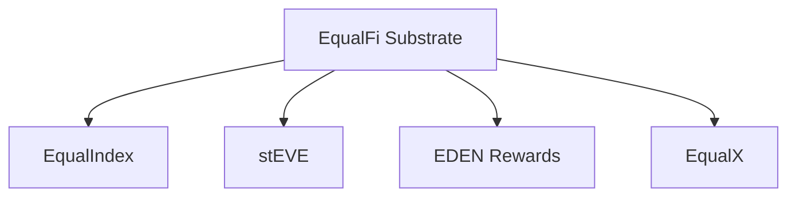

# Design Document

## Overview

This design introduces **EqualX** as the branded market layer for EqualFi.

EqualX is a greenfield replacement for the older Synthesis-era auction and
curve system. It does not aim to preserve:

- old facet names
- old selector groupings
- old storage shapes
- old ABI or API surfaces

Instead, it preserves the **useful market mechanics and invariants** while
anchoring them to the modern EqualFi substrate.

The proposed EqualX module split is:

1. **EqualX Solo AMM**
2. **EqualX Community AMM**
3. **EqualX Curve Liquidity**

These are related under one brand, but they should not be implemented as one
giant derivative blob.

## Design Goals

1. Reuse current EqualFi substrate primitives instead of reviving a legacy
   derivative substrate.
2. Keep solo, community, and curve state machines separate.
3. Preserve the economic and settlement invariants that mattered in the older
   system.
4. Make quotes and previews execution-faithful.
5. Make market expiry, cleanup, and claims permissionless wherever possible.
6. Keep the system friendly to native ETH where the EqualFi substrate already
   supports it.

## Non-Goals

This design does not:

- preserve the older Synthesis storage monolith
- merge curve liquidity into the AMM auction type
- require backwards compatibility with older EqualFi hackathon selectors
- require one market type to share lifecycle code with another when the state
  machines differ materially
- promise that every old test harness pattern will be ported directly

## Layering



### Boundary Rules

1. EqualFi substrate owns pools, positions, membership, canonical principal,
   FI, ACI, maintenance, currency semantics, and encumbrance.
2. EqualX owns market definitions, market lifecycle, quote logic, and market
   fee distribution.
3. EqualX does not own generic basket issuance, staking, or rewards.
4. EDEN rewards and EqualX market fees are distinct accounting domains.

## Source Material Mapping

The older Synthesis tree maps conceptually into the new EqualX design like
this:

- [AmmAuctionFacet.sol](/home/hooftly/.openclaw/workspace/hackathons/synthesis/submission/EqualFi/src/EqualX/AmmAuctionFacet.sol)
  -> EqualX Solo AMM
- [CommunityAuctionFacet.sol](/home/hooftly/.openclaw/workspace/hackathons/synthesis/submission/EqualFi/src/EqualX/CommunityAuctionFacet.sol)
  -> EqualX Community AMM
- [MamCurveCreationFacet.sol](/home/hooftly/.openclaw/workspace/hackathons/synthesis/submission/EqualFi/src/EqualX/MamCurveCreationFacet.sol)
  and related view / execution surfaces
  -> EqualX Curve Liquidity

The older swap math and indexed community fee accounting are still valuable:

- [LibAuctionSwap.sol](/home/hooftly/.openclaw/workspace/hackathons/synthesis/submission/EqualFi/src/libraries/LibAuctionSwap.sol)
- [LibCommunityAuctionFeeIndex.sol](/home/hooftly/.openclaw/workspace/hackathons/synthesis/submission/EqualFi/src/libraries/LibCommunityAuctionFeeIndex.sol)

These should be **ported conceptually**, not transplanted blindly.

## Proposed Module Layout

Representative file layout:

```text
src/equalx/
  EqualXSoloAmmFacet.sol
  EqualXCommunityAmmFacet.sol
  EqualXCurveCreationFacet.sol
  EqualXCurveExecutionFacet.sol
  EqualXCurveManagementFacet.sol
  EqualXViewFacet.sol

src/libraries/
  LibEqualXSoloAmmStorage.sol
  LibEqualXCommunityAmmStorage.sol
  LibEqualXCurveStorage.sol
  LibEqualXSwapMath.sol
  LibEqualXCommunityFeeIndex.sol
  LibEqualXLifecycle.sol
```

This deliberately avoids a single `LibDerivativeStorage` equivalent.

## Shared Design Principles

### 1. Canonical Backing

Maker backing should come from canonical settled principal and canonical
encumbrance rules already present in EqualFi.

Representative flow for a maker transition:

1. verify PNFT ownership
2. verify pool membership for backing pools
3. settle FI / ACI / maintenance-sensitive state as needed
4. lock or encumber backing capital
5. create or update the EqualX market

By default, EqualX should treat live in-pool maker backing as part of the
canonical ACI / encumbrance model. Solo AMM, Community AMM, and Curve
Liquidity should not silently fork into separate backing-eligibility semantics
unless a market type explicitly opts out in a later approved design.

### 2. No Hidden Background Processes

EqualX lifecycle must reflect the onchain rule that nothing happens
automatically.

That means:

- expiry must be triggered by a caller
- finalization must be callable by a caller
- stale markets must be cleanable permissionlessly
- quote validity must be explicit in state

### 3. Execution-Faithful Views

Every meaningful quote should have a matching preview path that uses the same
math and the same backing assumptions as execution.

This is especially important for:

- stable-mode AMM math
- fee-asset semantics
- curve profile pricing
- maker share accounting

### 4. Low-Gas Hot Paths

Solo AMM and Community AMM should preserve the older `../EqualFi` hot-path
accounting model when possible rather than eagerly reconciling canonical pool
principal on each swap.

That means:

- reserve deltas update on each swap
- maker fee buckets update on each swap
- treasury transfer, active-credit accrual, and fee-index accrual still happen
  on each swap through the canonical fee router
- principal and deposit reconciliation are deferred until market close, maker
  exit, or another explicit settlement path
- transient swap-cache style helpers are part of the intended execution model,
  not an optional afterthought

This is a design constraint for EqualX AMMs, not merely a later optimization
pass.

## Solo AMM Design

### Model

One maker position backs a two-sided time-bounded AMM.

Representative config:

```solidity
struct SoloAmmMarket {
    bytes32 makerPositionKey;
    uint256 makerPositionId;
    uint256 poolIdA;
    uint256 poolIdB;
    address tokenA;
    address tokenB;
    uint256 reserveA;
    uint256 reserveB;
    uint64 startTime;
    uint64 endTime;
    uint16 feeBps;
    FeeAsset feeAsset;
    InvariantMode invariantMode;
    bool active;
    bool finalized;
}
```

### Key Rules

1. Exactly one maker position owns the market.
2. Both reserve sides must be locked or encumbered at creation.
3. The market can be volatile or stable mode.
4. Anyone can trigger the expiry or finalize path when conditions are met.
5. Finalization must release or reconcile remaining backing cleanly.

### Fee Routing

Solo AMM fee routing should remain explicit:

- maker share first from the gross fee
- protocol remainder second
- treasury from the routed protocol remainder
- active-credit accrual from the routed protocol remainder
- fee-index accrual from the routed protocol remainder

The intended behavior to preserve from `../EqualFi` is:

1. compute the gross swap fee
2. carve out the maker share first
3. route only the remaining protocol fee through `LibFeeRouter`
4. transfer the treasury allocation on each swap
5. accrue active-credit and fee-index allocations from that same routed
   remainder

The old fee buckets should be re-validated against the current EqualFi
substrate, but the runtime policy above is the target behavior.

### Solo AMM Hot-Path Accounting

Solo AMM should preserve the older low-gas reserve-accounting pattern from
`../EqualFi`.

The intended execution model is:

1. use transient swap-cache style helpers for quote and execution inputs
2. mutate market-local reserve state on each swap
3. accrue maker fees on each swap
4. route only the protocol remainder through `LibFeeRouter`
5. allow treasury transfer, active-credit accrual, and fee-index accrual to
   happen on each swap
6. defer maker principal and pool deposit reconciliation until market close,
   cancellation, expiry, or another explicit maker settlement path

The old runtime pattern to preserve is not just "route fees somehow." It is
reserve-backed routing equivalent to `routeSamePool(..., false, extraBacking)`
where `extraBacking` comes from the live market reserve on the fee-side pool.
That lets treasury, active-credit, and fee-index effects happen immediately
without forcing tracked-principal churn on every swap.

EqualX should not pay a large gas premium on each swap just to make substrate
principal appear fully reconciled mid-market. The market's reserve state is the
live trading state; canonical principal settlement happens when the market is
unwound.

## Community AMM Design

### Model

Many maker positions share one AMM pool and earn fees by indexed ownership.

Representative shapes:

```solidity
struct CommunityAmmMarket {
    bytes32 creatorPositionKey;
    uint256 creatorPositionId;
    uint256 poolIdA;
    uint256 poolIdB;
    address tokenA;
    address tokenB;
    uint256 reserveA;
    uint256 reserveB;
    uint256 totalShares;
    uint256 makerCount;
    uint64 startTime;
    uint64 endTime;
    uint16 feeBps;
    FeeAsset feeAsset;
    InvariantMode invariantMode;
    bool active;
    bool finalized;
}

struct CommunityMakerPosition {
    uint256 share;
    uint256 feeIndexSnapshotA;
    uint256 feeIndexSnapshotB;
    uint256 initialContributionA;
    uint256 initialContributionB;
    bool isParticipant;
}
```

### Why Indexed Shares Matter

Community AMM cannot distribute fees by looping over all makers during each
swap. The older indexed fee model is still the right core design:

1. swaps accrue fee index deltas at the market level
2. makers checkpoint those deltas when joining, leaving, or claiming
3. principal and contribution reconciliation happen on explicit maker exit or
   market finalization rather than on every taker swap

### Community AMM Hot-Path Accounting

Community AMM should follow the same low-gas hot-path philosophy as Solo AMM.

The intended execution model is:

1. use transient swap-cache style helpers where they materially reduce hot-path
   overhead
2. mutate market-local reserve state on each swap
3. update the community maker fee index on each swap
4. route the protocol remainder through `LibFeeRouter` so treasury,
   active-credit, and fee-index accrual continue to happen on each swap
5. defer full maker principal, contribution, and share-backing reconciliation
   until maker leave, claim, finalization, or other explicit settlement paths

As with Solo AMM, the fee-routing semantics should stay reserve-backed rather
than forcing immediate tracked-principal debits. The pattern to preserve is
equivalent to `routeSamePool(..., false, extraBacking)` with `extraBacking`
coming from the live fee-side market reserve.

The core purpose of the indexed share model is not only correctness, but also
to avoid per-swap maker loops and per-swap canonical backing churn.
2. each maker snapshots fee indexes
3. settlement realizes only that maker’s pending fee share

This is one of the strongest ideas worth porting directly in spirit.

Community AMM fee handling should preserve the same two-stage model:

1. gross fee is computed on swap
2. maker share is accrued into the community maker fee index
3. only the remaining protocol fee is routed through `LibFeeRouter`
4. treasury is transferred immediately from that routed remainder
5. active-credit and fee-index accruals come from that same routed remainder

### Join / Leave Rules

Makers should:

1. join only before start unless an explicit design says otherwise
2. satisfy the required reserve ratio
3. settle their fee position before share changes
4. leave through a path that reconciles both fee entitlement and remaining
   reserve share

## Curve Liquidity Design

### Model

Curve Liquidity is not just “AMM with a flag.” It is a separate market family
where execution price comes from a configured pricing profile.

Even though pricing is profile-driven rather than reserve-ratio-driven, the
backing side should still compose with the EqualFi substrate like other
EqualX maker capital. The intended default is:

1. base-side backing is locked or encumbered in-pool
2. that live encumbered backing remains part of the canonical ACI model
3. curve execution consumes or releases backing through explicit settlement
   paths rather than ad hoc side ledgers

Representative split:

```solidity
struct CurveMarket {
    bytes32 commitment;
    uint128 remainingVolume;
    uint64 endTime;
    uint32 generation;
    bool active;
}

struct CurvePricing {
    uint128 startPrice;
    uint128 endPrice;
    uint64 startTime;
    uint64 duration;
}

struct CurveProfileData {
    uint16 profileId;
    bytes32 profileParams;
}
```

### Commitment / Generation Guards

The old commitment and generation model is worth preserving.

It protects takers from stale maker assumptions and protects makers from fills
against an outdated descriptor after an update.

Representative execution guard:

1. taker submits expected generation and commitment
2. execution checks live curve generation and commitment
3. execution reverts if the curve has changed

This should remain a core EqualX invariant.

### Pricing Profiles

Curve pricing should support:

1. at least one built-in profile in v1
2. governance-approved profile plugins
3. deterministic quote behavior
4. a view path that can either revert loudly or return `ok=false` when a custom
   profile cannot safely quote

For v1, the built-in list is intentionally narrow:

1. default linear profile only
2. any non-linear behavior comes from governance-approved profile plugins

## Swap Math

The older [LibAuctionSwap.sol](/home/hooftly/.openclaw/workspace/hackathons/synthesis/submission/EqualFi/src/libraries/LibAuctionSwap.sol)
captures three valuable ideas:

1. volatile and stable invariant support
2. fee-on-input vs fee-on-output semantics
3. explicit fee splitting helpers

EqualX should keep those ideas, but the library should be renamed and trimmed to
only the math and fee helpers that still fit the new system.

One important clarification: the old helper-level split utilities are not, by
themselves, the source of truth for runtime fee routing. The target runtime
behavior is the `../EqualFi` execution model:

1. maker fee from the gross fee
2. protocol remainder through `LibFeeRouter`
3. treasury transferred on each swap
4. active-credit and fee-index accrued from the routed remainder

## Native ETH Policy

EqualX should inherit EqualFi substrate currency behavior rather than inventing
new native ETH abstractions.

That means:

1. if a backing pool underlying is native ETH, EqualX may use native flows
2. native accounting should use the existing EqualFi currency helper
3. EqualX should not special-case ETH outside those substrate rules

## View Surface

EqualX views should be market-native rather than legacy-facet-native.

Representative discovery surface:

- markets by position
- markets by pair
- active markets
- maker participation state
- quote and preview helpers
- curve status and remaining volume

I would prefer one coherent EqualX view layer rather than many tiny legacy view
facets unless selector pressure forces a split.

## Testing Strategy

The right migration target is **invariant intent**, not test-file identity.

### Port Intents

From the older system, the main intents worth preserving are:

1. community fee index remainder and accrual correctness
2. AMM reserve and finalize correctness
3. curve commitment and generation mismatch protection
4. preview and execution parity
5. market cleanup and expiry correctness
6. native ETH accounting safety where applicable

### Rewrite Strategy

Prefer:

1. live-diamond or live-substrate setup
2. real position mint / deposit / membership flows
3. maintenance-aware tests
4. fewer setter-only harnesses

Use narrow storage harnesses only for:

1. pure math properties
2. isolated index remainder math
3. overflow / underflow edge properties

## Recommended Delivery Order

1. Port shared math and fee-index helpers.
2. Implement Solo AMM on the current EqualFi substrate.
3. Implement Community AMM using indexed fee accounting.
4. Implement Curve Liquidity with built-in profile support first.
5. Add governance-approved custom profile registry.
6. Port the strongest old invariants against the new live surface.
